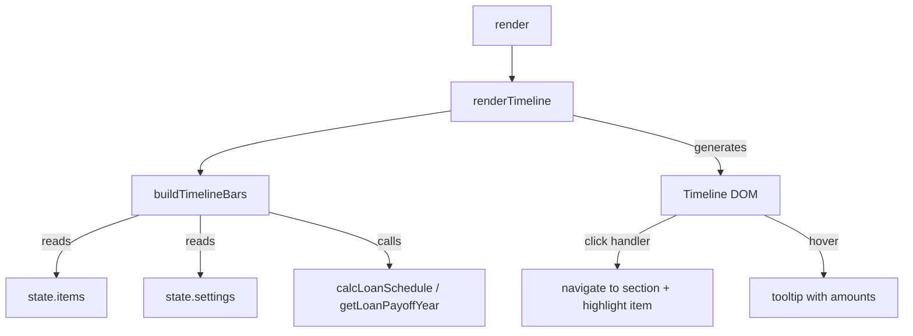
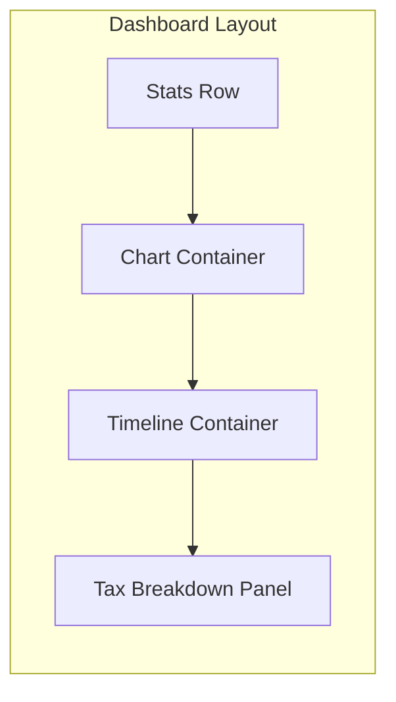

# Design Document: Cash Flow Timeline

## Overview

The Cash Flow Timeline is a Gantt-style horizontal bar visualization that renders below the projection chart on the dashboard. Each financial item in `state.items` is represented as a colored horizontal bar spanning its active years. The timeline shares the same year axis as the projection chart, letting users correlate chart trends with individual cash flow durations at a glance.

Key design decisions:

- **Pure HTML/CSS rendering** — No Chart.js canvas. Bars are `<div>` elements positioned proportionally along the year axis using percentage-based `left` and `width`. This keeps the implementation simple, makes click handling straightforward, and avoids coupling to Chart.js internals.
- **Single render function** — A new `renderTimeline()` function in `renderer.js` is called from `render()`. It rebuilds the timeline DOM on every render cycle, matching the existing pattern used by `renderItemList()`, `updateStats()`, etc.
- **No new modules** — All changes fit within existing module boundaries (`renderer.js`, `index.html`, `styles.css`, `build.js`, `script.js`). A small pure-data helper `buildTimelineBars()` is added to `renderer.js` to separate data preparation from DOM generation, making it testable.

## Architecture





Changes by module:

| Module | Change |
|---|---|
| `renderer.js` | New `buildTimelineBars(items, settings)` pure function that returns an array of bar descriptor objects. New `renderTimeline()` function that generates the timeline DOM. `render()` calls `renderTimeline()`. |
| `index.html` | New `<div id="timeline-container">` between `#chart-container` and `#taxBreakdownPanel`. |
| `styles.css` | New CSS rules for `.timeline-wrapper`, `.timeline-lane`, `.timeline-bar`, `.timeline-axis`, `.timeline-tooltip`, and mobile horizontal scroll. |
| `build.js` | No changes needed (renderer.js is already in the build list). |
| `script.js` | Re-export `buildTimelineBars` and `renderTimeline` for test access. |
| `eventHandlers.js` | No changes — click handlers are attached inline by `renderTimeline()`. |

## Components and Interfaces

### 1. `buildTimelineBars(items, settings)` — Pure Data Function

Transforms `state.items` and `state.settings` into an array of bar descriptor objects suitable for rendering. This function has no DOM dependencies and is fully testable.

**Signature:**
```javascript
export function buildTimelineBars(items, settings) → BarDescriptor[]
```

**BarDescriptor shape:**
```javascript
{
  itemIndex: number,          // index in state.items
  name: string,               // item.name
  type: string,               // item.type (e.g. 'bank', 'investments')
  color: string,              // resolved Type_Color hex string
  startYear: number,          // clamped to projection range
  endYear: number,            // clamped to projection range
  leftPct: number,            // percentage offset from left (0–100)
  widthPct: number,           // percentage width (0–100)
  contributionEndYear: number | null,  // if within bar span
  contributionEndPct: number | null,   // percentage position of contribution end marker
  loanPayoffYear: number | null,       // if within bar span
  loanPayoffPct: number | null,        // percentage position of loan payoff marker
  hasWithdrawal: boolean,     // whether item has active withdrawals
  amount: number,             // item.amount
  contributionAmount: number | null,
  contributionFrequency: string | null,
  withdrawalAmount: number | null,
  withdrawalFrequency: string | null,
  loanPaymentAmount: number | null     // monthly loan payment if applicable
}
```

**Logic:**
1. Compute `projStart = settings.startYear`, `projEnd = settings.startYear + settings.projectionYears - 1`.
2. For each item, clamp `barStart = max(item.startYear, projStart)` and `barEnd = min(item.endYear ?? projEnd, projEnd)`.
3. Skip items where `barStart > projEnd` or `barEnd < projStart` (entirely outside projection).
4. Compute `leftPct = (barStart - projStart) / totalYears * 100` and `widthPct = (barEnd - barStart + 1) / totalYears * 100` where `totalYears = projEnd - projStart + 1`.
5. If `item.contributionEndYear` is set and falls within `[barStart, barEnd]`, compute `contributionEndPct`.
6. If item has a loan, call `calcLoanSchedule` + `getLoanPayoffYear` and if payoff year is within `[barStart, barEnd]`, compute `loanPayoffPct`.
7. Resolve color from the `TYPE_COLORS` map.

### 2. `renderTimeline()` — DOM Rendering Function

Reads `state.items`, `state.settings`, and `state.activeSection`. If not on dashboard or no items, hides the container and returns.

**DOM structure generated:**
```html
<div id="timeline-container" class="card card-surface p-3 mb-4">
  <h6 class="mb-2"><i class="bi bi-calendar-range me-2"></i>Cash Flow Timeline</h6>
  <div class="timeline-wrapper">
    <!-- Year axis -->
    <div class="timeline-axis">
      <span style="left: 0%">2025</span>
      <span style="left: 20%">2030</span>
      ...
    </div>
    <!-- Lanes -->
    <div class="timeline-lane" data-item-index="0">
      <span class="timeline-lane-label">Savings Account</span>
      <div class="timeline-bar" style="left:0%; width:100%; background:#4fc3f7;" title="...">
        <!-- Optional transition markers -->
        <div class="timeline-marker" style="left:40%"></div>
      </div>
    </div>
    ...
  </div>
</div>
```

**Click handling:** Each `.timeline-bar` gets an `onclick` that:
1. Sets `state.activeSection` to the item's type.
2. Calls `render()`.
3. After render, finds the `.item-row[data-item-index="N"]` element and scrolls to it with a brief highlight animation.

**Tooltip:** Uses the `title` attribute for simplicity (native browser tooltip). The title string includes: item name, amount, contribution/withdrawal amounts if applicable, loan payment if applicable, and year range.

### 3. HTML Changes

A new container div is added to `index.html` between `#chart-container` and `#taxBreakdownPanel`:

```html
<!-- Cash Flow Timeline (dashboard) -->
<div class="card card-surface p-3 mb-4" id="timeline-container" style="display:none">
</div>
```

The container starts hidden. `renderTimeline()` controls its visibility based on `state.activeSection`.

### 4. CSS Changes

New rules added to `styles.css`:

- `.timeline-wrapper` — relative container, `overflow-x: auto` on mobile.
- `.timeline-axis` — relative row with year tick labels positioned absolutely by percentage.
- `.timeline-lane` — flex row with label + bar area, fixed height per lane.
- `.timeline-bar` — absolute-positioned div with rounded corners, type color background, `cursor: pointer`.
- `.timeline-bar:hover` — slight brightness increase for hover feedback.
- `.timeline-marker` — small vertical line/diamond marker for transition points (contribution end, loan payoff).
- `.timeline-bar-contribution` / `.timeline-bar-withdrawal` — opacity or pattern differentiation for contribution vs withdrawal segments.
- `.timeline-tooltip` — if we upgrade from `title` to a custom tooltip later.
- `.timeline-lane-label` — fixed-width label column.
- `.item-row.highlight` — brief highlight animation for click-to-navigate.
- Mobile: `@media (max-width: 767.98px)` — `.timeline-wrapper` gets `overflow-x: scroll` with a minimum width to ensure bars remain readable.

### 5. Render Integration

In `render()`, add a call to `renderTimeline()` alongside the existing calls:

```javascript
renderItemList();
updateBadges();
updateStats();
updateChart();
renderTimeline();    // NEW
renderTaxBreakdown();
```

### 6. Type Colors Map

A shared constant for type colors, extracted from the existing `updateChart()` inline object:

```javascript
const TYPE_COLORS = {
  bank: '#4fc3f7',
  investments: '#81c784',
  property: '#ffb74d',
  vehicles: '#e57373',
  rentals: '#ba68c8',
  inflows: '#4db6ac',
  outflows: '#f06292'
};
```

This is defined once in `renderer.js` and used by both `updateChart()` and `renderTimeline()`.

## Data Models

### BarDescriptor (internal, not persisted)

```javascript
{
  itemIndex: number,
  name: string,
  type: string,
  color: string,
  startYear: number,
  endYear: number,
  leftPct: number,
  widthPct: number,
  contributionEndYear: number | null,
  contributionEndPct: number | null,
  loanPayoffYear: number | null,
  loanPayoffPct: number | null,
  hasWithdrawal: boolean,
  amount: number,
  contributionAmount: number | null,
  contributionFrequency: string | null,
  withdrawalAmount: number | null,
  withdrawalFrequency: string | null,
  loanPaymentAmount: number | null
}
```

### No schema changes

This feature does not modify the persisted item schema, settings schema, or localStorage keys. All data is derived at render time from existing `state.items` and `state.settings` fields.

### TYPE_COLORS constant

```javascript
const TYPE_COLORS = {
  bank: '#4fc3f7',
  investments: '#81c784',
  property: '#ffb74d',
  vehicles: '#e57373',
  rentals: '#ba68c8',
  inflows: '#4db6ac',
  outflows: '#f06292'
};
```

Used by `buildTimelineBars()` to resolve bar colors and by `updateChart()` (refactored from inline object).


## Correctness Properties

*A property is a characteristic or behavior that should hold true across all valid executions of a system — essentially, a formal statement about what the system should do. Properties serve as the bridge between human-readable specifications and machine-verifiable correctness guarantees.*

### Property 1: Bar span clamping to projection range

*For any* item and any valid settings (startYear, projectionYears), the bar descriptor returned by `buildTimelineBars` should have `startYear = max(item.startYear, projStart)` and `endYear = min(item.endYear ?? projEnd, projEnd)`, and the `leftPct` and `widthPct` should be consistent with these clamped years: `leftPct = (barStart - projStart) / totalYears * 100` and `widthPct = (barEnd - barStart + 1) / totalYears * 100`.

**Validates: Requirements 1.3, 2.2, 2.3, 2.5, 2.6, 6.1, 6.2**

### Property 2: Bar descriptor correctness

*For any* set of items where each item's active range overlaps the projection range, `buildTimelineBars` should return exactly one bar per item, and each bar's `color` should equal `TYPE_COLORS[item.type]`, `name` should equal `item.name`, and `hasWithdrawal` should be `true` if and only if the item has `withdrawalAmount > 0`.

**Validates: Requirements 2.1, 3.1, 3.2, 4.2, 5.2**

### Property 3: Contribution end marker position

*For any* item with a non-null `contributionEndYear` that falls within the clamped bar span `[barStart, barEnd]`, the bar descriptor should have `contributionEndPct = (contributionEndYear - barStart) / (barEnd - barStart + 1) * 100`. When `contributionEndYear` is null or outside the bar span, `contributionEndPct` should be `null`.

**Validates: Requirements 4.1**

### Property 4: Loan payoff marker position

*For any* item with a loan whose payoff year (as computed by `getLoanPayoffYear(calcLoanSchedule(...))`) falls within the clamped bar span `[barStart, barEnd]`, the bar descriptor should have `loanPayoffPct = (payoffYear - barStart) / (barEnd - barStart + 1) * 100`. When there is no loan or the payoff year is outside the bar span, `loanPayoffPct` should be `null`.

**Validates: Requirements 10.1**

### Property 5: Tooltip contains required information

*For any* item, the tooltip string built for its timeline bar should contain: the item name, the formatted item amount, and the year range string. Additionally, if the item has a contribution amount, the tooltip should contain the contribution amount; if it has a withdrawal amount, the tooltip should contain the withdrawal amount; if it has a loan, the tooltip should contain the monthly loan payment amount.

**Validates: Requirements 5.1, 10.2**

### Property 6: Non-dashboard sections hide the timeline

*For any* active section that is not `'dashboard'`, calling `renderTimeline()` should result in the timeline container being hidden (display = 'none').

**Validates: Requirements 1.2, 8.2**

## Error Handling

| Scenario | Handling |
|---|---|
| `state.items` is empty | `renderTimeline()` hides the timeline container. `buildTimelineBars()` returns an empty array. |
| Item `startYear` > projection end year | Item is skipped by `buildTimelineBars()` (bar would have zero or negative width). |
| Item `endYear` < projection start year | Item is skipped by `buildTimelineBars()` (entirely before projection range). |
| Item has no `endYear` (null) | Treated as ongoing — bar extends to projection end year. |
| `projectionYears` is 0 or negative | `buildTimelineBars()` returns empty array (totalYears ≤ 0). |
| Item has loan but `calcLoanSchedule` returns empty | `getLoanPayoffYear` returns `null`. No loan payoff marker is shown. |
| Item type not in `TYPE_COLORS` | Falls back to `'#aaa'` default color. |
| `timeline-container` element missing from DOM | `renderTimeline()` returns early with no error (null-check pattern matching existing renderer code). |
| Click handler on bar for deleted item | After `render()` is called, the item list won't contain the item. The highlight scroll will simply not find a matching `.item-row` element — no error thrown. |

## Testing Strategy

### Property-Based Tests (fast-check)

The project uses `fast-check` v4.6.0 with 100 iterations configured globally in `tests/setup.js`. Each correctness property maps to one property-based test.

| Property | Test Location | Generator Strategy |
|---|---|---|
| P1: Bar span clamping | `tests/renderer.test.js` | Generate random items with startYear/endYear (some null) and random settings. Verify clamped years and percentage calculations. |
| P2: Bar descriptor correctness | `tests/renderer.test.js` | Generate random sets of items (1–10) all overlapping the projection range. Verify count, color, name, and hasWithdrawal flag. |
| P3: Contribution end marker | `tests/renderer.test.js` | Generate items with random contributionEndYear (some within bar span, some outside, some null). Verify contributionEndPct. |
| P4: Loan payoff marker | `tests/renderer.test.js` | Generate items with random loan configs. Verify loanPayoffPct matches independently computed payoff year. |
| P5: Tooltip completeness | `tests/renderer.test.js` | Generate random items with varying contribution/withdrawal/loan fields. Build tooltip string and verify all required fields are present. |
| P6: Non-dashboard hiding | `tests/renderer.test.js` | Generate random non-dashboard section names from ALL_TYPES. Verify timeline container is hidden after renderTimeline(). |

Each test must be tagged with a comment:
```javascript
// Feature: cash-flow-timeline, Property N: [property text]
```

### Unit Tests

Unit tests complement property tests for specific examples and edge cases:

| Test | Location | What it verifies |
|---|---|---|
| Empty items array hides timeline | `tests/renderer.test.js` | Edge case (9.2) |
| Dashboard shows timeline | `tests/renderer.test.js` | Example (1.1, 8.1) |
| Item entirely before projection is excluded | `tests/renderer.test.js` | Edge case (2.5) |
| Item entirely after projection is excluded | `tests/renderer.test.js` | Edge case |
| Click handler sets activeSection | `tests/renderer.test.js` | Example (11.1) |
| Click handler triggers highlight class | `tests/renderer.test.js` | Example (11.2) |
| Year axis tick labels match projection range | `tests/renderer.test.js` | Example (6.3) |
| Ongoing item (null endYear) extends to projEnd | `tests/renderer.test.js` | Example (2.3) |

### Testing Library

- **Property-based testing:** `fast-check` (already installed, v4.6.0)
- **Test runner:** `vitest` (already installed, v4.1.0, jsdom environment)
- **Minimum iterations:** 100 per property test (configured globally)
- Each correctness property MUST be implemented by a SINGLE property-based test
