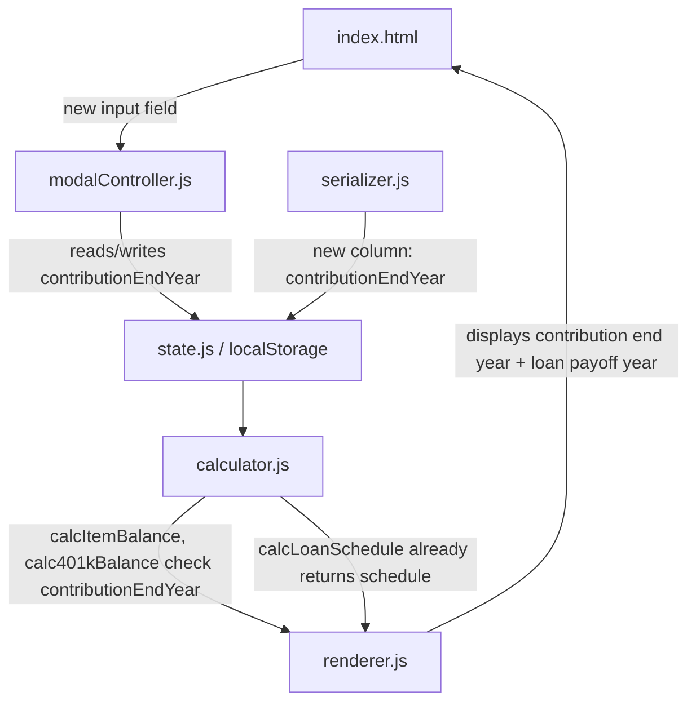

# Design Document: Contribution End Date and Loan Payoff

## Overview

This feature extends the Retirement Cash Flow Planner with two capabilities:

1. **Contribution End Year** — An optional `contributionEndYear` field on items that tells the calculator to stop adding contributions after a specified year, even though the account remains active. This lets users model scenarios like stopping 401(k) contributions at retirement while the account continues to grow.

2. **Loan Payoff Year Display** — A computed display on property/vehicle item rows showing the projected year the loan balance reaches zero, derived from the existing `calcLoanSchedule` output.

Both features are purely additive. No existing data model fields change meaning, no existing calculation outputs change for items that don't use the new field, and the serializer remains backward-compatible with files that lack the new column.

## Architecture

The changes follow the existing module boundaries:



No new modules are introduced. Each existing module gains a small, isolated change:

| Module | Change |
|---|---|
| `calculator.js` | `calcItemBalance` and `calc401kBalance` check `item.contributionEndYear` to zero out contributions after that year. A new helper `getLoanPayoffYear(schedule)` extracts the first year with closing balance = 0. |
| `modalController.js` | New "Contribution End Year" input in the contribution group. Validation: must be ≥ startYear if provided. Read/write on save/edit. |
| `renderer.js` | Show "until [year]" on contribution meta line. Show "Paid off: [year]" or "Paid off: beyond [year]" on loan detail line. |
| `serializer.js` | Add `contributionEndYear` column to export headers and row mapping. Read it on import with null fallback. |
| `index.html` | Add the `field-contributionEndYear` input inside `#contributionGroup`. |
| `script.js` | Re-export `getLoanPayoffYear` if added as a named export. |

## Components and Interfaces

### 1. Contribution End Year Input (Modal)

A new numeric input field is added inside the existing `#contributionGroup` div in `index.html`:

```html
<div class="col-6">
  <label class="form-label" for="field-contributionEndYear">Contribution End Year</label>
  <input type="number" class="form-control" id="field-contributionEndYear" min="1900" max="2200" />
</div>
```

`modalController.js` changes:
- `_clearNewFields()` — add `'field-contributionEndYear'` to the cleared IDs list.
- `openEditModal()` — populate the field from `item.contributionEndYear`.
- `_handleSaveItem()` — read the field, validate (if non-empty, must be ≥ startYear), and include `contributionEndYear` in the saved item object.

### 2. Calculator Changes

**`calcItemBalance(item, year, balanceCache, projectionEndYear)`**

Inside the yearly loop, the annual contribution computation gains a guard:

```javascript
var annualContrib = 0;
if (item.contributionAmount != null && item.contributionAmount > 0) {
  if (item.contributionEndYear == null || y <= item.contributionEndYear) {
    annualContrib = item.contributionFrequency === 'monthly'
      ? item.contributionAmount * 12
      : item.contributionAmount;
  }
}
```

**`calc401kBalance(item, year, balanceCache, projectionEndYear)`**

In the contribution branch (before withdrawal start year), employee contribution and employer match are zeroed when `y > item.contributionEndYear`:

```javascript
var contributionsActive = (item.contributionEndYear == null || y <= item.contributionEndYear);
var effectiveEmployeeContribution = contributionsActive ? employeeContribution : 0;
// employer match also depends on employee contribution being active
```

**`getLoanPayoffYear(schedule)`** — new pure function:

```javascript
export function getLoanPayoffYear(schedule) {
  for (var i = 0; i < schedule.length; i++) {
    if (schedule[i].closingBalance <= 0) return schedule[i].year;
  }
  return null; // loan extends beyond projection
}
```

### 3. Renderer Changes

In `renderItemList()`, the contribution meta line changes from:

```
+$500/mo contribution
```

to (when contributionEndYear is set):

```
+$500/mo contribution (until 2035)
```

For loan items, after the existing loan balance/equity line, a new line is appended:

```
Paid off: 2042
```
or
```
Paid off: beyond 2054
```

### 4. Serializer Changes

**Export:** Add `'contributionEndYear'` to the `headers` array. In the row mapping, emit `item.contributionEndYear != null ? item.contributionEndYear : ''`.

**Import:** Read `row.contributionEndYear` using the existing `numOrNull` helper. No special handling needed — missing columns already produce `undefined` which `numOrNull` converts to `null`.

## Data Models

### Item Object (extended)

```javascript
{
  // ... existing fields ...
  contributionEndYear: number | null,  // NEW — optional, four-digit year
  // ... existing fields ...
}
```

The field is `null` when not set (contributions run for the full active period) or a four-digit year when set (contributions stop after that year inclusive).

### Validation Rules

| Field | Rule |
|---|---|
| `contributionEndYear` | If provided: must be a finite integer ≥ `item.startYear`. If blank/empty: stored as `null`. |

### Loan Payoff Year (computed, not stored)

The loan payoff year is not persisted. It is derived at render time from `calcLoanSchedule()`:

```javascript
getLoanPayoffYear(schedule) → number | null
```

Returns the first `schedule[i].year` where `closingBalance <= 0`, or `null` if the loan is never paid off within the projection period.


## Correctness Properties

*A property is a characteristic or behavior that should hold true across all valid executions of a system — essentially, a formal statement about what the system should do. Properties serve as the bridge between human-readable specifications and machine-verifiable correctness guarantees.*

### Property 1: Contribution Cutoff in calcItemBalance

*For any* bank or investment item with a non-null `contributionEndYear` and a 0% growth rate, the balance at any year `y > contributionEndYear` should equal the balance at `contributionEndYear` (i.e., no further contributions are added after the cutoff, and with 0% rate the balance is flat).

**Validates: Requirements 2.1, 2.2, 2.4**

### Property 2: Contribution Cutoff Boundary Equivalence

*For any* item with contributions and a `contributionEndYear`, the balance computed by `calcItemBalance` at every year `y ≤ contributionEndYear` should be identical to the balance of an otherwise-equivalent item that has `contributionEndYear: null`.

**Validates: Requirements 2.3, 2.6**

### Property 3: 401(k) Contribution Cutoff

*For any* 401(k) item with a non-null `contributionEndYear` and a 0% growth rate (before withdrawal start), the balance at any year `y > contributionEndYear` should equal the balance at `contributionEndYear` — meaning employee contributions and employer match are both zero after the cutoff.

**Validates: Requirements 2.5**

### Property 4: Loan Payoff Year Correctness

*For any* loan configuration and projection period, `getLoanPayoffYear(schedule)` returns the year of the first schedule entry with `closingBalance <= 0`, or `null` if no such entry exists. Equivalently: if the result is a year, then `schedule[payoffIndex].closingBalance <= 0` and all prior entries have `closingBalance > 0`; if the result is `null`, then every entry has `closingBalance > 0`.

**Validates: Requirements 5.2, 5.3**

### Property 5: ContributionEndYear Excel Round-Trip

*For any* item with a `contributionEndYear` value (including `null`), exporting to Excel and then importing the resulting file should produce an item whose `contributionEndYear` equals the original value.

**Validates: Requirements 4.1, 4.2, 4.4**

## Error Handling

| Scenario | Handling |
|---|---|
| `contributionEndYear < startYear` | Modal validation error: "Contribution End Year must be ≥ Start Year." Save is blocked. |
| `contributionEndYear` is non-numeric | `Number()` produces `NaN` → validation rejects with "Contribution End Year must be a valid number." |
| `contributionEndYear` field left blank | Stored as `null`. Calculator treats as "no cutoff" — contributions run for the full active period. |
| Import file missing `contributionEndYear` column | `numOrNull(undefined)` returns `null`. Item behaves as if no cutoff was set. Backward-compatible. |
| `getLoanPayoffYear` receives empty schedule | Returns `null` (no payoff year). Renderer shows nothing or "beyond" depending on context. |
| Loan amount is 0 | `calcLoanSchedule` produces a schedule where the first entry already has `closingBalance = 0`. `getLoanPayoffYear` returns `startYear`. |

No new error states are introduced beyond the modal validation. All calculator and serializer changes degrade gracefully to existing behavior when the new field is absent or null.

## Testing Strategy

### Property-Based Tests (fast-check)

The project already uses `fast-check` with 100 iterations configured globally in `tests/setup.js`. Each correctness property above maps to one property-based test.

| Property | Test Location | Generator Strategy |
|---|---|---|
| P1: Contribution Cutoff in calcItemBalance | `tests/calculator.test.js` | Generate random items with `contributionEndYear` between `startYear` and `endYear`, rate = 0, and verify balance is flat after cutoff. |
| P2: Contribution Cutoff Boundary Equivalence | `tests/calculator.test.js` | Generate two items (one with `contributionEndYear`, one without), compare balances at years ≤ cutoff. |
| P3: 401(k) Contribution Cutoff | `tests/calculator.test.js` | Generate random 401(k) items with `contributionEndYear`, rate = 0, verify balance flat after cutoff. |
| P4: Loan Payoff Year Correctness | `tests/calculator.test.js` | Generate random loan configs, compute schedule, verify `getLoanPayoffYear` matches manual scan. |
| P5: ContributionEndYear Excel Round-Trip | `tests/serializer.test.js` | Extend existing `fullItemArb` with `contributionEndYear` field, verify round-trip preserves it. |

Each test must be tagged with a comment:
```javascript
// Feature: contribution-end-date-and-loan-payoff, Property N: [property text]
```

### Unit Tests

Unit tests complement the property tests for specific examples and edge cases:

| Test | Location | What it verifies |
|---|---|---|
| `contributionEndYear < startYear` rejected | `tests/calcItemBalance.test.js` | Validation edge case (1.4) |
| `contributionEndYear = null` matches old behavior | `tests/calcItemBalance.test.js` | Backward compat example (2.3) |
| `getLoanPayoffYear` with zero loan amount | `tests/calcLoanSchedule.test.js` | Edge case: returns startYear (5.4) |
| `getLoanPayoffYear` with loan that never pays off | `tests/calcLoanSchedule.test.js` | Edge case: returns null (5.3) |
| Renderer shows "until [year]" | `tests/renderer.test.js` | UI example (3.1) |
| Renderer shows "Paid off: [year]" | `tests/renderer.test.js` | UI example (6.1) |
| Renderer shows "Paid off: beyond [year]" | `tests/renderer.test.js` | UI example (6.2) |
| Import with missing contributionEndYear column | `tests/serializer.test.js` | Backward compat edge case (4.3) |

### Testing Library

- **Property-based testing:** `fast-check` (already installed, v4.6.0)
- **Test runner:** `vitest` (already installed, v4.1.0, jsdom environment)
- **Minimum iterations:** 100 per property test (configured globally)
