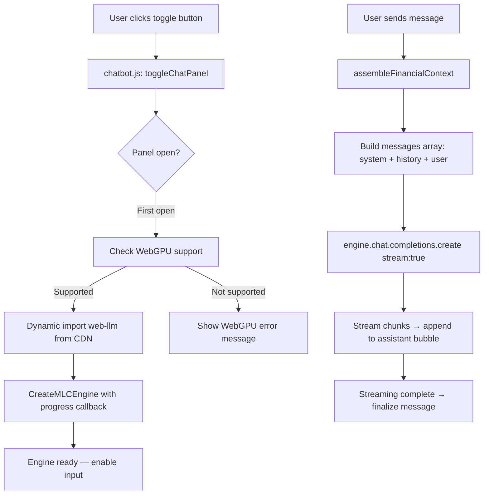
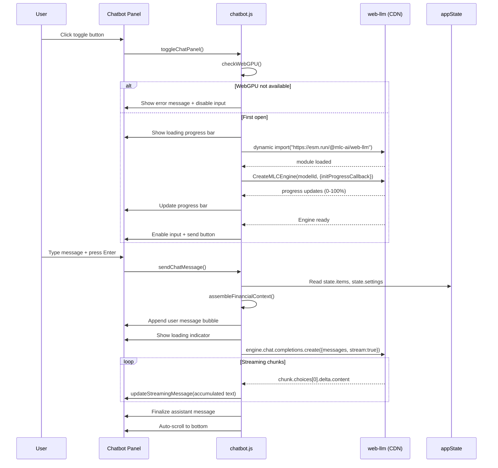

# Design Document: In-Browser Chatbot

## Overview

This design adds an in-browser AI chatbot to the Retirement Cash Flow Planner (RCFP). The chatbot runs a small language model entirely client-side using the `@mlc-ai/web-llm` library via WebGPU. Users can ask natural-language questions about their financial data without any server round-trips or API keys.

The chatbot is implemented as a single new ES module (`js/chatbot.js`) that integrates with the existing build pipeline. It introduces a slide-out panel anchored to the right side of the viewport, a floating toggle button, and streaming response display. Financial context is assembled fresh from `state.items` and `state.settings` on every user message.

## Architecture

The chatbot feature follows the existing application pattern: a new ES module that imports shared state and exposes window globals for onclick handlers. The WebLLM library is loaded lazily via dynamic `import()` from a CDN, keeping it external to the app bundle.



### Key Design Decisions

1. **Lazy loading**: The web-llm library (~few MB) is only fetched when the user first opens the chatbot panel. This avoids impacting initial page load.
2. **Single module**: All chatbot logic lives in `js/chatbot.js` — engine lifecycle, context assembly, message handling, and DOM manipulation. This matches the app's existing pattern where each module owns its DOM section.
3. **No framework**: Consistent with the rest of the app, the chatbot UI is built with plain DOM manipulation and Bootstrap utility classes.
4. **Session-scoped conversation**: Chat history lives in a module-level array and resets on page reload. No localStorage persistence for chat messages.
5. **Fresh context per message**: `state.items` and `state.settings` are serialized into the system prompt on every send, so the model always sees the latest data.

## Components and Interfaces

### 1. chatbot.js (Chat_Module)

The main module. Exports functions that `main.js` and `build.js` expose on `window`.

```javascript
// Public API (exposed on window)
export function toggleChatPanel()    // Opens/closes the panel; triggers model load on first open
export function sendChatMessage()    // Reads input, sends to engine, streams response

// Internal functions (not exported)
function initEngine()                // Dynamic imports web-llm, calls CreateMLCEngine
function assembleFinancialContext()  // Serializes state.items + state.settings into system prompt text
function appendMessage(role, text)   // Adds a message bubble to the chat DOM
function updateStreamingMessage(text)// Updates the current assistant bubble during streaming
function setInputEnabled(enabled)    // Enables/disables the input field and send button
function showError(message)          // Displays an error message in the chat area
function checkWebGPU()               // Returns boolean for navigator.gpu availability
```

### 2. HTML Additions (index.html)

Two new elements added to the page:

- **Toggle button**: A fixed-position floating button (bottom-right corner) with a chat icon. Always visible. Shows a tooltip when WebGPU is unavailable.
- **Chatbot panel**: A fixed-position panel on the right side of the viewport containing:
  - Header with title and close button
  - Message area (scrollable div)
  - Input area with text input and send button

```html
<!-- Chatbot toggle button -->
<button id="chatbot-toggle" class="btn btn-accent" onclick="toggleChatPanel()"
        title="Chat with AI about your plan"
        aria-label="Toggle AI chatbot">
  <i class="bi bi-chat-dots-fill"></i>
</button>

<!-- Chatbot panel -->
<div id="chatbot-panel" class="card-surface" style="display:none" role="complementary" aria-label="AI Chatbot">
  <div id="chatbot-header">
    <span>AI Assistant</span>
    <button onclick="toggleChatPanel()" aria-label="Close chatbot">
      <i class="bi bi-x-lg"></i>
    </button>
  </div>
  <div id="chatbot-messages" aria-live="polite"></div>
  <div id="chatbot-input-area">
    <input type="text" id="chatbot-input" placeholder="Ask about your plan..."
           disabled aria-label="Chat message input" />
    <button id="chatbot-send" onclick="sendChatMessage()" disabled
            aria-label="Send message">
      <i class="bi bi-send-fill"></i>
    </button>
  </div>
</div>
```

### 3. CSS Additions (styles.css)

New styles for the chatbot panel and toggle button, using existing CSS custom properties:

- `#chatbot-toggle`: Fixed position, bottom-right, z-index above content
- `#chatbot-panel`: Fixed position, right side, full height, 360px wide on desktop, 100% width on mobile (≤768px)
- `#chatbot-messages`: Flex column, overflow-y auto, scrollable message area
- `.chatbot-msg-user` / `.chatbot-msg-assistant`: Distinct alignment and background colors using `--surface`, `--accent`, `--text`
- `.chatbot-msg-error`: Error styling with red tint
- `.chatbot-progress`: Progress bar for model loading

### 4. Build Integration

`build.js` changes:
- Add `'js/chatbot.js'` to the `files` array (after `js/eventHandlers.js`)
- Add `window.toggleChatPanel = toggleChatPanel;` and `window.sendChatMessage = sendChatMessage;` to the globals section

`main.js` changes:
- Import `toggleChatPanel` and `sendChatMessage` from `./chatbot.js`
- Expose both on `window`

`script.js` changes:
- Re-export `toggleChatPanel` and `sendChatMessage` from `./js/chatbot.js`

### 5. Interaction Flow



## Data Models

### Conversation History

Module-level array storing the chat session:

```javascript
// Each entry in the conversation history
{
  role: 'user' | 'assistant' | 'system',
  content: string  // The message text
}
```

The conversation history is rebuilt into the messages array sent to the engine on each request:
1. System message (financial context) — always position 0, refreshed each time
2. Previous user/assistant messages from history
3. Current user message

### Financial Context Format

The system prompt is a plain-text serialization of the user's financial data:

```
You are a helpful financial planning assistant. The user has the following retirement plan data:

SETTINGS:
- Start Year: 2025
- Projection Years: 30
- Filing Status: single
- Birth Year: 1970
- Annual Social Security Benefit: $24,000
- Social Security Start Year: 2037

ITEMS:
1. [Bank Account] "Emergency Fund" — Savings
   Amount: $50,000 | Rate: 4.5% | Years: 2025–ongoing
   Contributions: $500/mo (until 2030)

2. [Investment] "Brokerage" — Stocks
   Amount: $200,000 | Rate: 7% | Years: 2025–2060
   Withdrawals: $2,000/mo

3. [Property] "Primary Home" — Primary Home
   Amount: $450,000 | Rate: 3% | Years: 2020–ongoing
   Loan: $300,000 at 6.5%, $1,900/mo payment, escrow $400/mo

...

Answer questions about this retirement plan. Be concise and helpful.
```

### Engine State

Module-level variables tracking engine lifecycle:

```javascript
let engine = null;           // The MLCEngine instance (null until loaded)
let engineLoading = false;   // True while model is downloading/initializing
let engineReady = false;     // True once CreateMLCEngine resolves
let conversationHistory = []; // Array of {role, content} objects
let isGenerating = false;    // True while streaming a response
```

### Model Configuration

```javascript
const MODEL_ID = 'SmolLM2-360M-Instruct-q4f16_1-MLC';
```

A small model (~360M parameters, quantized to 4-bit) suitable for in-browser execution. WebLLM handles caching the model weights in the browser's Cache API after the first download.


## Correctness Properties

*A property is a characteristic or behavior that should hold true across all valid executions of a system — essentially, a formal statement about what the system should do. Properties serve as the bridge between human-readable specifications and machine-verifiable correctness guarantees.*

### Property 1: Toggle round-trip

*For any* initial panel visibility state (open or closed), calling `toggleChatPanel()` twice should return the panel to its original visibility state.

**Validates: Requirements 1.1, 1.2**

### Property 2: Toggle button present across all sections

*For any* application section (dashboard, inflows, outflows, bank, investments, property, vehicles, rentals), the chatbot toggle button element should exist in the DOM and be visible.

**Validates: Requirements 1.5**

### Property 3: Financial context completeness

*For any* set of `state.items` (each with name, type, category, amount, rate, startYear, endYear, and optional contributionAmount, contributionFrequency, contributionEndYear, withdrawalAmount, withdrawalFrequency, loan details) and *for any* `state.settings` (with startYear, projectionYears, and tax sub-object), the string returned by `assembleFinancialContext()` should contain every item's name, type, category, and amount, and should contain the settings' startYear and projectionYears.

**Validates: Requirements 3.1, 3.2, 3.3**

### Property 4: Message array structure

*For any* user message text and *for any* conversation history of length N, the messages array passed to `engine.chat.completions.create()` should have a system message at index 0 containing the financial context, followed by the N history entries in order, followed by the new user message at the end.

**Validates: Requirements 3.4, 4.1**

### Property 5: Context freshness on state change

*For any* two distinct states S1 and S2 (where S1 and S2 differ in at least one item or setting value), if a message is sent under S1 and then state is changed to S2 and another message is sent, the system prompt in the second call should reflect S2's data, not S1's.

**Validates: Requirements 3.5**

### Property 6: Message display and distinct styling

*For any* message appended to the chat (user or assistant), the message should appear as a DOM element in the messages container, and user messages should have a different CSS class than assistant messages.

**Validates: Requirements 4.3, 4.4**

### Property 7: Conversation history growth

*For any* sequence of N user-assistant message exchanges, the conversation history array should contain exactly 2N entries (N user + N assistant), and each entry should preserve its original content and role.

**Validates: Requirements 4.5**

### Property 8: Streaming chunk accumulation

*For any* sequence of text chunks [c1, c2, ..., cN] received from the engine, after processing chunk ci the displayed assistant message text should equal the concatenation c1+c2+...+ci, and after all chunks are processed the finalized conversation history entry should contain c1+c2+...+cN.

**Validates: Requirements 5.1, 5.2, 5.3**

### Property 9: WebGPU detection correctness

*For any* browser environment, `checkWebGPU()` should return `true` if and only if `navigator.gpu` is defined and truthy.

**Validates: Requirements 8.1**

## Error Handling

| Scenario | Handling |
|---|---|
| WebGPU not available (`navigator.gpu` undefined) | Toggle button gets a tooltip indicating WebGPU required. Panel shows a static error message listing compatible browsers (Chrome 113+, Edge 113+). Input remains disabled. |
| CDN import fails (network error) | `initEngine()` catches the rejection, sets `engineLoading = false`, calls `showError()` with a network error message. Input remains disabled. User can close and reopen panel to retry. |
| `CreateMLCEngine` rejects (model download failure, OOM, etc.) | Same as CDN failure — error displayed in panel, input stays disabled. |
| `engine.chat.completions.create()` throws during streaming | The streaming loop catches the error, appends an error message bubble to the chat, sets `isGenerating = false`, re-enables input. Conversation history does not include the failed response. |
| User sends message while engine is still generating | `sendChatMessage()` checks `isGenerating` flag and returns early (no-op). The send button should appear disabled during generation. |
| Empty or whitespace-only user input | `sendChatMessage()` trims the input and returns early if empty. No message is sent. |
| State has zero items | `assembleFinancialContext()` produces a valid context string with an empty ITEMS section. The model can still answer general questions. |

## Testing Strategy

### Unit Tests

Unit tests verify specific examples, edge cases, and integration points:

- `assembleFinancialContext()` with a known set of items produces expected output string
- `assembleFinancialContext()` with zero items produces valid context with empty items section
- `assembleFinancialContext()` with items containing loan details includes loan fields
- `checkWebGPU()` returns false when `navigator.gpu` is undefined
- `checkWebGPU()` returns true when `navigator.gpu` is defined
- `toggleChatPanel()` opens panel when closed
- `toggleChatPanel()` closes panel when open
- `sendChatMessage()` does nothing when input is empty/whitespace
- `sendChatMessage()` does nothing when `isGenerating` is true
- Error display when engine initialization fails
- Panel shows WebGPU error message when not supported
- Model ID constant matches a known small model (≤1.5B params)

### Property-Based Tests

Property-based tests use `fast-check` (already a dev dependency) to verify universal properties across randomized inputs. Each test runs a minimum of 100 iterations.

Each property test references its design document property with a comment tag:
- **Feature: in-browser-chatbot, Property 1: Toggle round-trip**
- **Feature: in-browser-chatbot, Property 3: Financial context completeness**
- **Feature: in-browser-chatbot, Property 4: Message array structure**
- **Feature: in-browser-chatbot, Property 5: Context freshness on state change**
- **Feature: in-browser-chatbot, Property 6: Message display and distinct styling**
- **Feature: in-browser-chatbot, Property 7: Conversation history growth**
- **Feature: in-browser-chatbot, Property 8: Streaming chunk accumulation**
- **Feature: in-browser-chatbot, Property 9: WebGPU detection correctness**

Property tests focus on the pure/testable functions: `assembleFinancialContext()`, `checkWebGPU()`, conversation history management, and message array construction. Tests that require the actual web-llm engine will mock `engine.chat.completions.create()` to return controlled async iterables of chunks.

### Test File

All chatbot tests go in `tests/chatbot.test.js`, following the existing test file naming convention.
